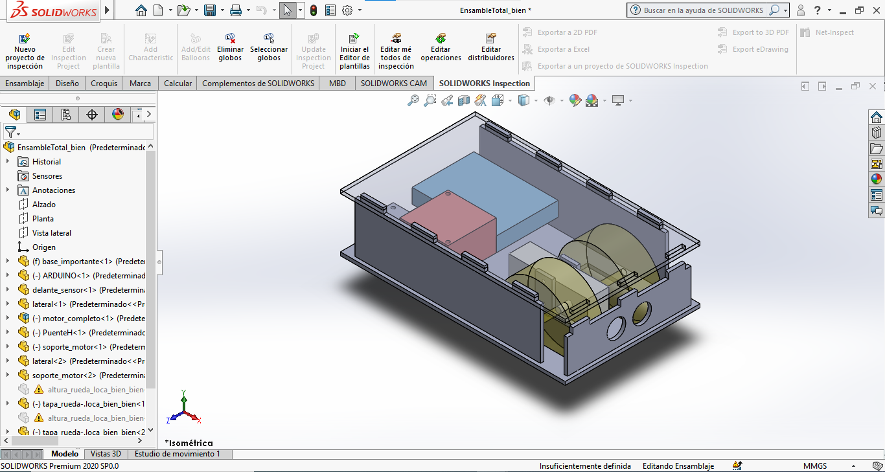

# Control-de-distancia-delantera-carrito-ARDUINO

> Este proyecto fue realizado para la materia **Controladores Hibridos** de la carrera **Ingeniería en AUtomatización y Autotrónica** para **8vo semestre**

# Introducción 

El presente repositorio indica cómo se puede realizar un controlador basado en lógica difusa. El proyecto consiste en controlar la distancia delantera de un carrito, la sensor que usaremos es un **HC-SR04** para hacer la retroalimentación y todo estará programado en un **ARDUINO UNO** _(importante mensionar que es igual de posible en una Raspberry)_. Los actuadores que usaremos son motorreductores _(de los amarillos)_, para controlar el movimiento de los actuadores usaremos un **Puente H, L298N** y dos fuentes de energía, una será para alimentar el Arduino (5V a 1A) y otra fuente para alimentar el puente H (5V a 2.5A)

# Contextualización del problema

### Justificación 

Al finalizar este proyecto se entregará un carrito con control de distancia delantero. Se plantea una solución propuesta para el nuevo hito automotriz enfocado a la **Protección a peatones**, en donde cada que sea detectado un obstaculo cerca del auto exista un actuador que indique alguna recomendación o acción de reacción. 

En cuanto al ámbito escolar, se busca una asimilación de la importancia de os procesos de simulación _(DIGITALIZACIÓN)_ desde un punto de vista matemático _(CAE)_. Esto con la finalidad de facilitar la toma de decisiones basado en datos estadísticos y en función de un controlador no discreto. 

### Objetivos
**Generales**
+ Diseñar un controlador basado el lógica difusa para controlar un carrito en función de una distacia delantera de 20 centímetros (+,- 2 cm) con ayuda de un sensor ultrasonico.

**Particulares**
+ Realizar una investigacion sobre las funciones de membresia, grado de pertenencia

+ Realizar una práctica que permita realizar el posicionamiento de un servomotor utilizando un potenciometro en lazo cerrado

+ Hacer pruebas. 

## Carrito Final

El carrito que se entrega al final del curso se realiza con MDF _(Medium Density Fiberboard)_. El diseño del carrito se realiza en **SolidWorks 2020**, la programación se realiza en **Arduino**.

